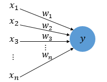

# 퍼셉트론(Perceptron)
퍼셉트론(Perceptron)은 프랑크 로젠블라트(Frank Rosenblatt)가 1957년에 제안한 초기 형태의 인공 신경망입니다. 신경 세포인 뉴런을 본 딴 구조를 제안되었습니다. 실무에서는 퍼셉트론보다는 짧은 뉴런으로 부르는 경향이 있는 거 같습니다.

뉴런은 가지돌기에서 신호를 받아들이고, 이 신호가 일정 이상의 크기를 가지면 축삭돌기를 통해 다음 뉴런에게 신호를 전달합니다. 이 부분에서 신호를 취합하는 부분을 수식으로 표현하면 아래와 같이 표현할 수 있습니다. 이 단계에선 입력값과 출력값을 0,1 로 한정하여 설명합니다. 

$$
\sum^{n}_{i = 1} w_{i}x_{i}
$$

$x$는 신호 입력, $w$는 각 신호의 가중치를 의미합니다. 이를 그림으로 표현한다면 아래와 같습니다. 

위의 수식에서 표현되지 않은 부분을 마저 표현하면 아래와 같은 수식을 확인 할 수 있습니다. 취합된 신호를 크기를 판단하고, 다음 뉴런에서 신호를 전달하는 부분까지 구현되었습니다.

$$
\begin{align*}
    \sum^{n}_{i = 1} w_{i}x_{i} \ge \theta &\Rightarrow 1 \\
    \sum^{n}_{i = 1} w_{i}x_{i} < \theta &\Rightarrow 0
\end{align*} 
$$

$\theta$는 임계 값(Threshold)를 의미합니다. 수식을 해석해본다면 신호의 가중합이 임계값을 넘어설때 1 혹은 0의 신호를 발생시키게 됩니다. 여기서 $\theta$를 좌측 수식으로 옮겨(평행이동 하여) 좀 더 일반화 할 수 있습니다. 이를 편향, $b$ 로 표기하기도 합니다. 아래에서도 $b$로 표기하겠습니다. 참고로 $b$가 미정인 상태여서 부호를 자유롭게 결정할 수 있기 때문에 편향의 수식 상 부호 표현은 작성자마다 자유로운 편입니다.

$$
\begin{align*}
    \sum^{n}_{i = 1} w_{i}x_{i} - b \ge 0 &\Rightarrow 1 \\
    \sum^{n}_{i = 1} w_{i}x_{i} - b < 0 &\Rightarrow 0
\end{align*} 
$$

편향된 퍼셉트론은 아래와 같이 표현될 수 있습니다.

이젠 부등호를 수식적으로 표현해보겠습니다. 기존과 같이 수식을 두 번 표기해줘도 의미는 차이 없으나, 간단하게 표현할 수 있으면 간단하게 표기하는게 좋습니다.  해당 함수는 기본적인 계단 함수(Step Function)로 표현할 수 있습니다.

계단 함수를 살펴보시면 특정 값 미만의 값에서는 지속적으로 0을 출력하다가 특정 값 이상인 경우 1을 출력하는 것을 살펴볼 수 있습니다. 이걸 수식적으로 표현하게 되면 아래와 같습니다.  

$$
f(x) = 
\left\{ 
	\begin{array}{lr} 
		x \ge 0 & \Rightarrow 1 \\ 
		x < 0 & \Rightarrow 0 
	\end{array} \right.
$$

이제 계단 함수를 일반화된 함수의 표현인 $f$로 대체해 보겠습니다.

$$
\sum^{n}_{i = 1} f(w_{i}x_{i}- b) = y
$$

방금 사용했던 계단 함수를 일반화한 것을 활성화 함수(Activation Function)이라고 합니다. 활성화 함수에 대해서는 추후 설명하겠습니다. 기존 함수에서는 0과 1로 결과값을 지정하여 표현하는 부분이 있었으나, 함수로 변경되며 $y$로 달리 표현해 주었습니다. 함수 부분으로 $\theta$ 혹은 $b$를 포함시켜준다면 아래와 같이 표현될 수 도 있습니다. 

$$
\sum^{n}_{i = 1} f_{\theta}(w_{i}x_{i}) = y
$$

이 떄의 계단 함수는 수식적으로 아래와 같을 것입니다.

$$
f_{\theta}(x) = 
\left\{ 
	\begin{array}{lr} 
		x \ge \theta & \Rightarrow 1 \\ 
		x < \theta & \Rightarrow 0 
	\end{array} \right.
$$

위의 계단함수를 표기한 방식은 단순히 어떻게 수식을 표현하냐의 문제이므로 별로 신경쓰실 필요는 없습니다. 다만 특정 수식의 꼴로 변경 후, 해당 형태를 사용하는 계산법들을 사용하는 경우가 있으니 유의바랍니다. 이런식으로 사용자마다 용도에 따르게 다양하게 표현하기 때문에 정의를 잘 살피셔야 한다는 의미에서 조금 더 넣어봤습니다. 

보통은 최종적으로는 아래와 같이 일반화된 수식을 자주 접할 것입니다. 

$$
\sum^{n}_{i = 1} f(w_{i}x_{i}) = y
$$